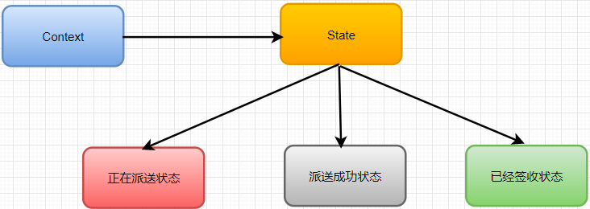
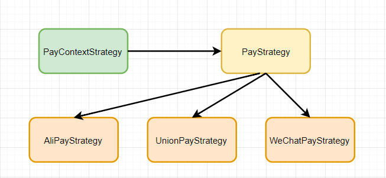

# 状态模式

状态模式一般用来实现状态机，而状态机常用在游戏、工作流引擎等系统开发中。
不过，状态机的实现方式有多种，除了状态模式，比较常用的还有分支逻辑法和查表法。

有限状态机，英文翻译是 Finite State Machine，缩写为 FSM，简称为状态机。
状态机有 3 个组成部分：状态（State）、事件（Event）、动作（Action）。
其中，事件也称为转移条件（Transition Condition）。事件触发状态的转移及动作的执行。
不过，动作不是必须的，也可能只转移状态，不执行任何动作。

状态模式是状态机的一种实现方法。它通过将事件触发的状态转移和动作执行，拆分到不同的状态类中，
以此来避免状态机类中的分支判断逻辑，应对状态机类代码的复杂性。

在状态模式（State Pattern）中，类的行为是基于它的状态改变的。这种类型的设计模式属于行为型模式。
在状态模式中，我们创建表示各种状态的对象和一个行为随着状态对象改变而改变的 context 对象。

意图：允许对象在内部状态发生改变时改变它的行为，对象看起来好像修改了它的类。

主要解决：对象的行为依赖于它的状态（属性），并且可以根据它的状态改变而改变它的相关行为。

何时使用：代码中包含大量与对象状态有关的条件语句。

如何解决：将各种具体的状态类抽象出来。

关键代码：通常命令模式的接口中只有一个方法。而状态模式的接口中有一个或者多个方法。而且，状态模式的实现类的方法，一般返回值，或者是改变实例变量的值。也就是说，状态模式一般和对象的状态有关。实现类的方法有不同的功能，覆盖接口中的方法。状态模式和命令模式一样，也可以用于消除 if...else 等条件选择语句。

应用实例： 1、打篮球的时候运动员可以有正常状态、不正常状态和超常状态。 2、曾侯乙编钟中，'钟是抽象接口','钟A'等是具体状态，'曾侯乙编钟'是具体环境（Context）。

优点： 1、封装了转换规则。 2、枚举可能的状态，在枚举状态之前需要确定状态种类。 3、将所有与某个状态有关的行为放到一个类中，并且可以方便地增加新的状态，只需要改变对象状态即可改变对象的行为。 4、允许状态转换逻辑与状态对象合成一体，而不是某一个巨大的条件语句块。 5、可以让多个环境对象共享一个状态对象，从而减少系统中对象的个数。

缺点： 1、状态模式的使用必然会增加系统类和对象的个数。 2、状态模式的结构与实现都较为复杂，如果使用不当将导致程序结构和代码的混乱。 3、状态模式对"开闭原则"的支持并不太好，对于可以切换状态的状态模式，增加新的状态类需要修改那些负责状态转换的源代码，否则无法切换到新增状态，而且修改某个状态类的行为也需修改对应类的源代码。

使用场景： 1、行为随状态改变而改变的场景。 2、条件、分支语句的代替者。

注意事项：在行为受状态约束的时候使用状态模式，而且状态不超过 5 个。

状态模式:
例如网购的商品订单，处于不同的状态，但是是针对同一订单的不同的状态。同一处理方法，状态切换了做的事情就不同。

策略模式:
例如聚合支付平台，有支付宝、微信支付、银联支付等，可以使用不同的支付策略

状态模式和策略模式区别
1、状态模式重点在各状态之间的切换，从而做不同的事情；而策略模式更侧重于根据具体情况选择策略，并不涉及切换。

2、状态模式不同状态下做的事情不同，而策略模式做的都是同一件事。例如，聚合支付平台，有支付宝、微信支付、银联支付，虽然策略不同，但最终做的事情都是支付，也就是说他们之间是可替换的。反观状态模式，各个状态的同一方法做的是不同的事，不能互相替换。

3、状态模式封装了对象的状态，而策略模式封装算法或策略。因为状态是跟对象密切相关的，它不能被重用；而策略模式通过从Context中分离出策略或算法，我们可以重用它们。

4、在状态模式中，每个状态通过持有Context的引用，来实现状态转移；但是每个策略都不持有Context的引用，它们只是被Context使用。

5、状态模式将各个状态所对应的操作分离开来，即对于不同的状态，由不同的子类实现具体操作，不同状态的切换由子类实现，当发现传入参数不是自己这个状态所对应的参数，则自己给Context类切换状态；这种转换是"自动"，"无意识"的。状态模式允许对象在内部状态改变时改变它的行为，对象看起来好像修改了它的类。而策略模式是直接依赖注入到Context类的参数进行策略选择，不存在切换状态的操作。

6、策略模式的客户端必须对所有的策略类相当了解，明确当前场景下各种策略的利弊，权衡在当前场景下应该使用哪种策略，也就是是说策略类对客户端是暴露的，策略是外界给的，策略怎么变，是调用者考虑的事情，系统只是根据所给的策略做事情。

状态模式依赖于其状态的变化时其内部的行为发生变化，将动作委托到代表当前状态的对象，对外表现为类发生了变化。状态是系统自身的固有的，由系统本身控制，调用者不能直接指定或改变系统的状态转移。